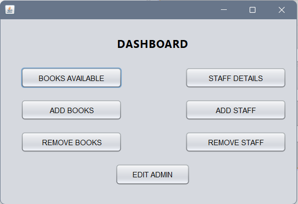
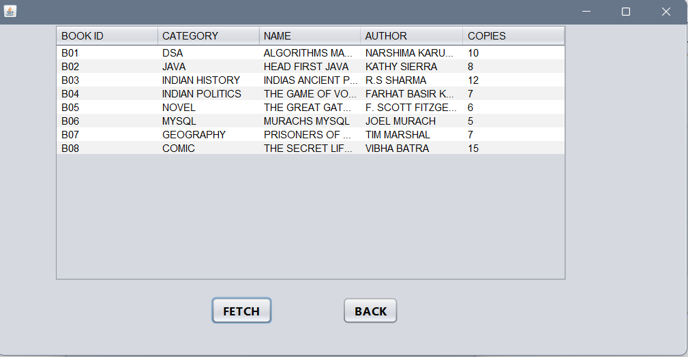
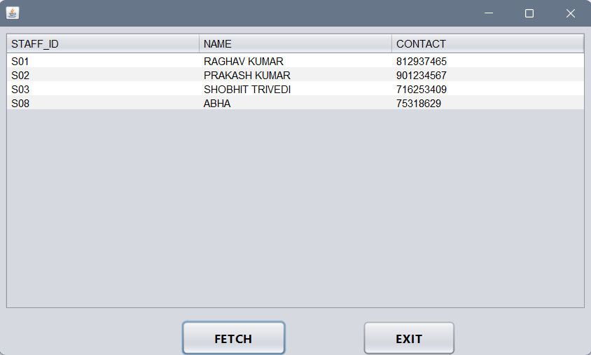
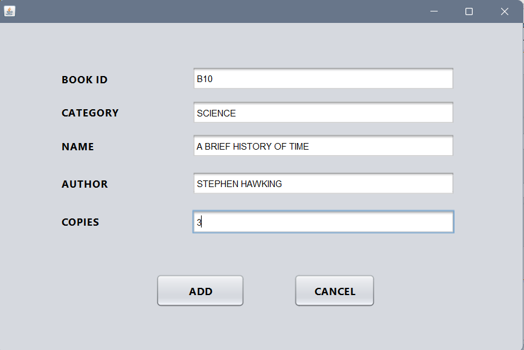
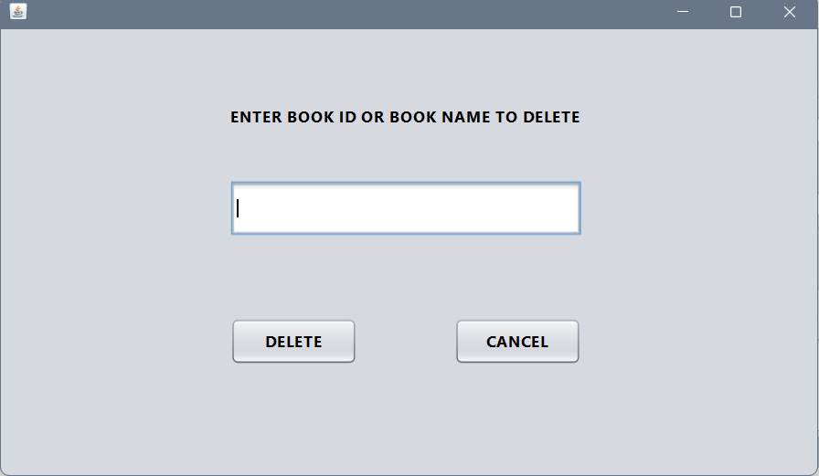
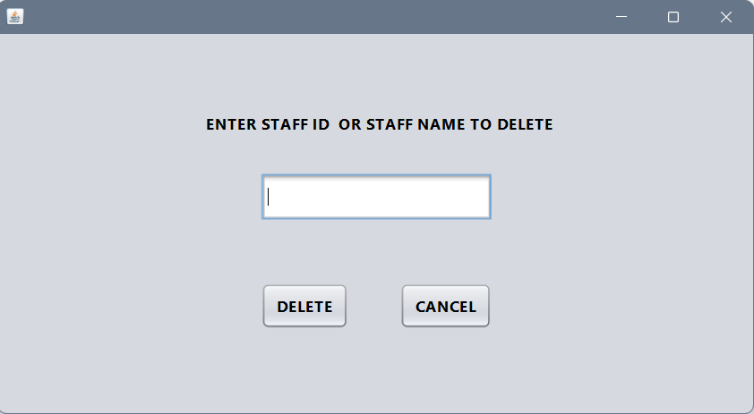

# Library-Management-System

A simple Java-based Library Management System developed using NetBeans.

## 🚀 Features
- Add/view/edit/delete staff and books
- Search for books by name or ID
- Issue and return books

## 🛠️ Technologies
- Java
- NetBeans IDE

## 📸 Results
### 1. Login Page

### 2. Dashboard

### 3. View Books Available

### 4. View Staff Details

### 5. Add Books

### 6. Remove Books

### 7. Remove Staff

### 8. Edit Admin

## 🙋‍♀️ Developed By Khushi Satarkar

Connect with me here! (Linkedin: [https://www.linkedin.com/in/khushi-satarkar-039056254/])
